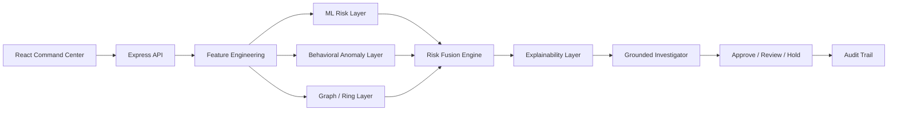

# RISKSHIELD AI

### AI-Powered Payment Risk Intelligence & Abuse Investigation

RISKSHIELD AI is a production-style prototype for the **AI Risk Manager** category of the Razorpay Buildathon 2026. It is designed around a simple idea: payment risk is rarely one bad transaction. The strongest signals often come from the relationship between behavior, identity, devices, IPs, merchants, and time.

Instead of returning only `fraud` or `not fraud`, RiskShield produces a decision that an analyst can defend:

1. A transaction-level fraud probability
2. A behavioral anomaly score
3. A graph-based connected-account risk score
4. A configurable fused risk score
5. Grounded evidence and a deterministic investigation summary
6. A controlled recommendation: `APPROVE`, `REVIEW`, or `HOLD`
7. An application-level analyst audit trail

## Why traditional fraud detection is not enough

A single transaction model can miss coordinated behavior. Three accounts using the same device, IP, merchant, timing pattern, and similar amounts may each look only moderately risky in isolation. Together, they form a stronger abuse-ring signal.

RiskShield makes those layers visible in one investigation workspace rather than hiding them behind a single opaque score.

## Product surface

- **Command Center** — risk posture, current alerts, distribution, trends, active rings, and protected value
- **Live Transaction Monitor** — search and filter synthetic payment events
- **Investigation Workspace** — fusion breakdown, evidence, AI-style grounded summary, confidence, and analyst decision
- **Abuse Ring Explorer** — connected accounts, devices, IPs, merchants, timing similarity, and ring score
- **What-if Simulator** — adjust risk inputs without changing real records
- **Model Intelligence** — precision, recall, F1, ROC-AUC, confusion matrix, feature importance, and baseline comparison
- **Business Impact** — fraud amount detected, estimated protected value, false-positive cost, and net protected value
- **Audit Trail** — chronological system recommendations and analyst decisions

## Architecture



See [`docs/architecture.md`](docs/architecture.md) for the detailed data flow and production hardening path.

## How risk fusion works

```text
final risk = 0.50 × ML probability
           + 0.25 × behavioral anomaly
           + 0.25 × graph connection risk
```

Risk levels are configurable in the backend:

| Score | Level |
| ---: | :--- |
| 0–30 | LOW |
| 31–60 | MEDIUM |
| 61–80 | HIGH |
| 81–100 | CRITICAL |

Recommendations are deliberately controlled:

- `APPROVE` below 51
- `REVIEW` from 51 through 80
- `HOLD` at 81 and above

## Synthetic data and evaluation

The demo dataset is synthetic and logically generated. It contains normal payments, high-value deviations, new device/location events, velocity spikes, failed-attempt patterns, and multiple connected abuse rings. Fraud labels are assigned from those scenarios—not randomly.

The model page calculates precision, recall, F1, confusion matrix, and pairwise ROC-AUC from the generated evaluation set. The app does not claim that these demo metrics represent live Razorpay performance.

## Run locally

```bash
pnpm install
pnpm --filter @workspace/api-spec run codegen
pnpm --filter @workspace/api-server run dev
pnpm --filter @workspace/riskshield-ai run dev
```

The workspace workflows start the API at `/api` and the RiskShield web app at `/`.

## API

- `GET /api/dashboard/summary`
- `GET /api/transactions`
- `GET /api/transactions/:transactionId`
- `GET /api/alerts`
- `GET /api/rings`
- `GET /api/rings/:ringId`
- `GET /api/model/metrics`
- `POST /api/risk/analyze`
- `POST /api/simulate`
- `GET /api/audit`
- `POST /api/audit/action`

FastAPI-style interactive documentation is not available because this build uses the workspace's Express service, but the complete contract is maintained in `lib/api-spec/openapi.yaml`.

## Responsible AI and limitations

- Synthetic data cannot establish production model performance.
- The investigator summary is deterministic and generated only from structured evidence returned by the risk engine.
- The system makes recommendations only; it does not autonomously block, refund, or cancel payments.
- Audit entries are application-level records, not a cryptographically immutable ledger.
- Shared identifiers can have legitimate explanations; graph evidence should be reviewed with appropriate privacy and governance controls.

## Demo flow

1. Open the Command Center and point out the distinction between high-risk alerts and active rings.
2. Open `txn_5E4F18` to show a critical payment linked to `ring_07`.
3. Walk through the three risk contributors and grounded evidence.
4. Choose an analyst action and show it appear in Audit Trail.
5. Open What-if Simulator and remove the new device / failed attempts to show risk movement.
6. Finish on Model Intelligence and Business Impact to connect model quality to operational value.